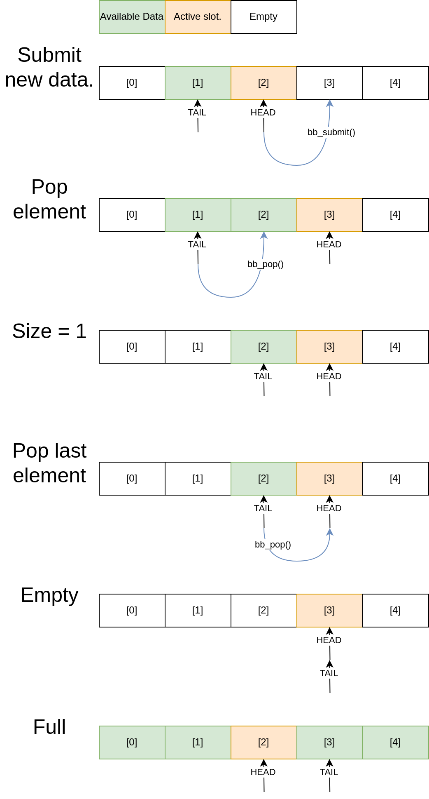

# Buffer Architecture: Lock-Free Fast Path Design

## Overview

The bpipe2 buffer system implements a high-performance ring buffer designed for single-producer, single-consumer (SPSC) scenarios with an optimized lock-free fast path for maximum throughput.

## Core Design Principles

### Ring Buffer Structure
The buffer uses a circular array with head and tail pointers that wrap around using power-of-2 sizes for efficient modulo operations via bit masking.



### Lock-Free Fast Path
When space is available (producer) or data is available (consumer), operations proceed without locks:
- **Producer**: Writes to head position and increments atomically
- **Consumer**: Reads from tail position and increments atomically
- Memory barriers ensure proper ordering between threads

### Blocking Slow Path
Locks are only acquired when waiting is required:
- **Buffer Full**: Producer blocks until consumer frees space
- **Buffer Empty**: Consumer blocks until producer adds data
- Condition variables enable efficient thread sleeping/waking

## Key Operations

### Submit (Producer)
```
1. Check if full (atomic read)
2. If space available:
   - Write data at head position
   - Increment head (atomic)
   - Signal not_empty condition
3. If full:
   - Acquire mutex
   - Wait on not_full condition
   - Proceed when space available
```

### Delete (Consumer)
```
1. Check if empty (atomic read)
2. If data available:
   - Read data at tail position
   - Increment tail (atomic)
   - Signal not_full condition
3. If empty:
   - Acquire mutex
   - Wait on not_empty condition
   - Proceed when data available
```

## Performance Benefits

1. **Zero contention on fast path** - No locks when buffer has space/data
2. **Cache-friendly** - Producer and consumer work on different cache lines
3. **Predictable latency** - Lock-free path has consistent timing
4. **Scalable throughput** - Approaches memory bandwidth limits

## Implementation Notes

- Head/tail pointers use separate cache lines to avoid false sharing
- Power-of-2 sizes enable efficient wraparound: `index = position & (size - 1)`
- Memory barriers ensure visibility across CPU cores
- Statistics (dropped_batches, total_batches) updated atomically